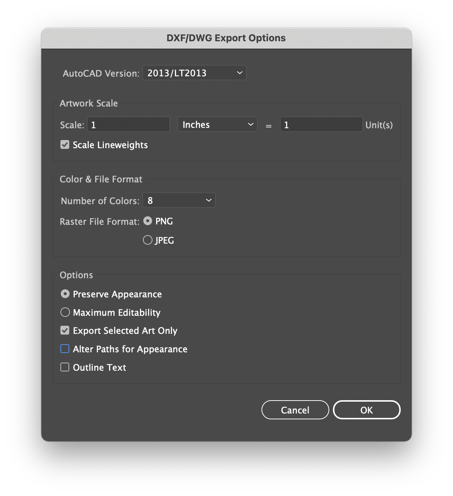

**Preparing the File**

1. Make visible only the "mount" and "maximum pcb size" layers

2. Select all desired objects and copy them.

3. Paste the objects and drag them to a new place on the screen

4. With all desired objects still highlighted, go to "Object" in the Menu and select "Ungroup". Do this a total of three times.

5. Change fill to empty and change stroke to black - you can find this under "Window" in the menu and select "Color". Note that some objects may remain gray. This hasn't caused a problem yet.

6. Make sure they're still all selected the whole time. Go to "File >> Export >> Export as..."

7. Name the file and change the file type to "Autodesk RealDWG (dxf)" and click "Export"

8. Follow the instructions and screenshot below to finish generating DFX file.

	**DFX Exportation Settings**
	
	
	AutoCAD version: R13/LT95 or 2000/LT2000 or 2013/LT2013
	
	**Artwork Scale**
	
	Scale: 1 Inches = 1 Unit(s). (Millimeters has also been known to work with LT2000)
	
	Checked or Unchecked: Scale Lineweights. (depends on your preference for the appearance)
	
	**Color & File Format:**
	
	Number of Colors: 8. (256 seems to work too)
	
	Raster Format: PNG
	
	**Options**
	
	Select: Preserve Appearance
	
	Checked or Unchecked: Export Selected Art Only (this just sets whether you want to export the whole document or just your selection)
	
	Unchecked: Alter Paths for Appearance. (sometimes it needs to be checked, not sure what this really does)
	
	Checked: Outline Text (unless you already outlined the text)
	
	

9. In KiCad, open the PCB editor and select File > Import > Graphics

10. Click Browse to select your DXF file. Use the following options. You can select any Graphic Layer, but it's recommended to use User.Drawings, User.Comments, User.Eco1, or User.Eco2.

	
