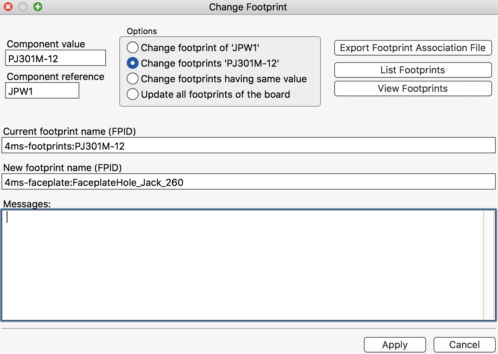
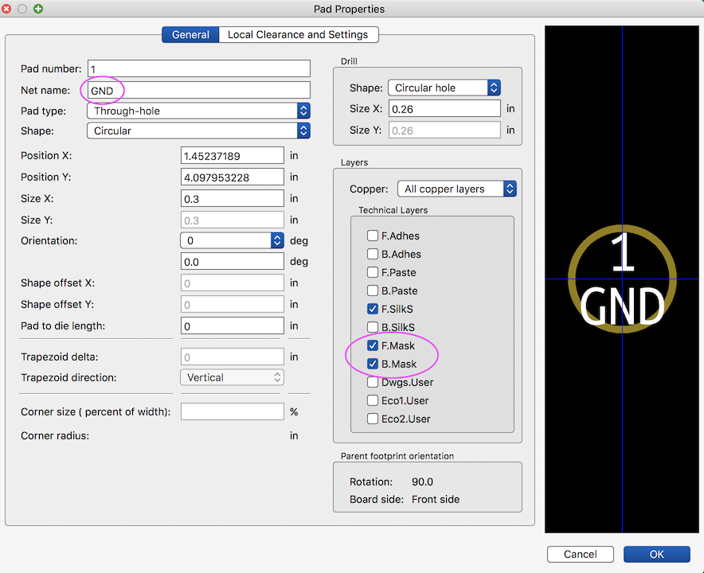
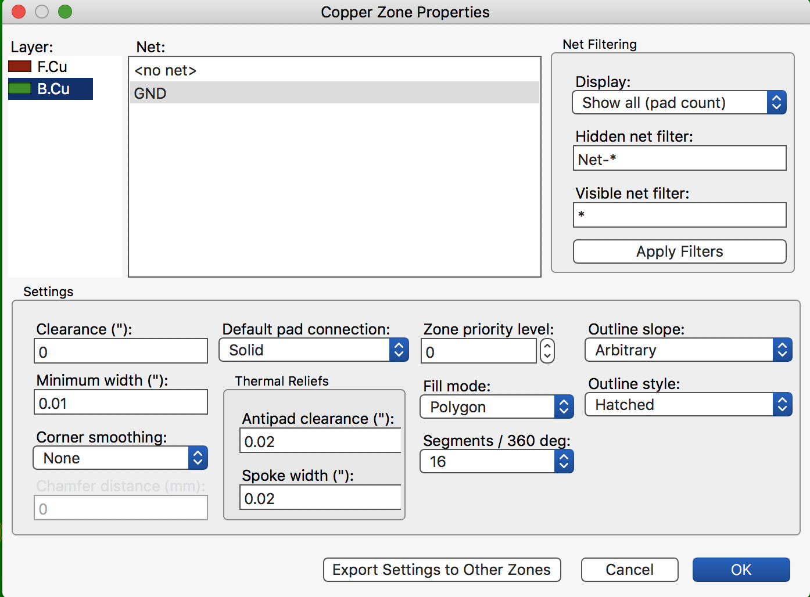
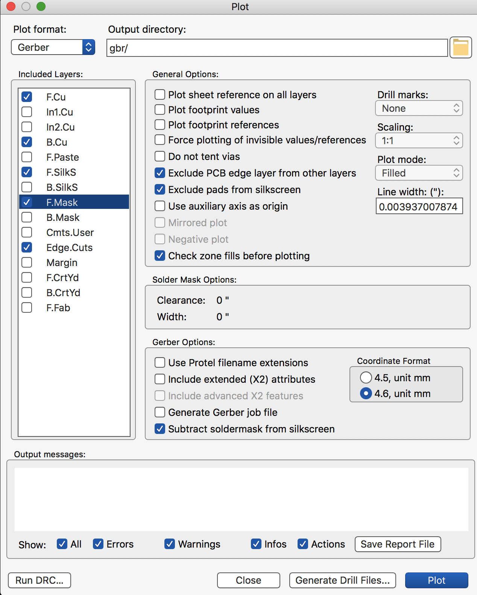
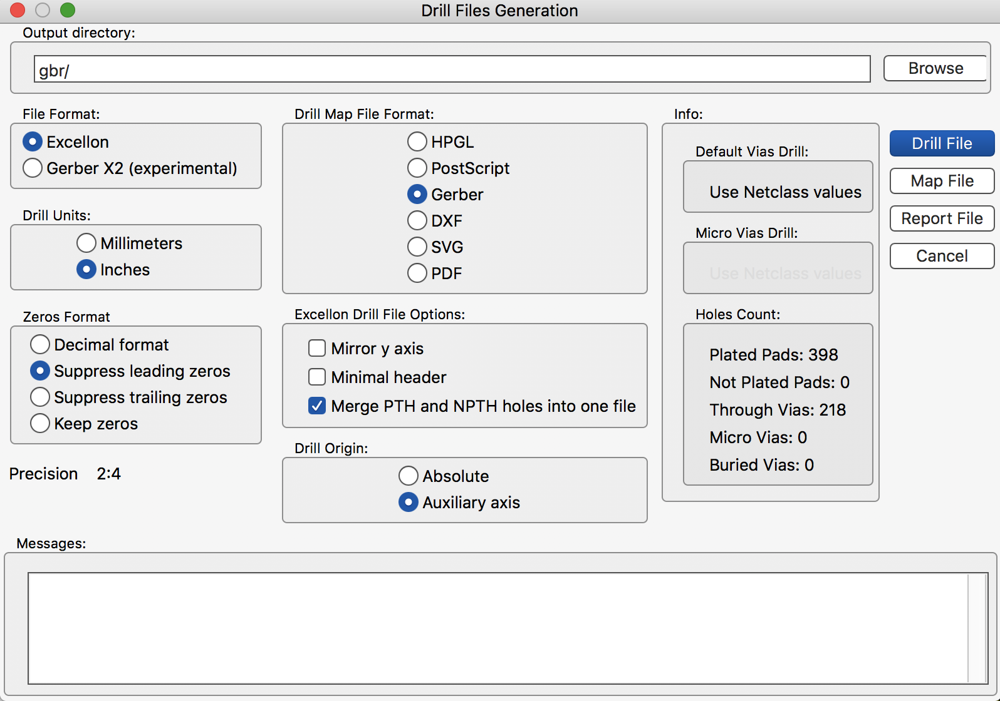

## HOW TO MAKE A FACEPLATE in KiCAD##
     
### Part 1: PCB Faceplate (holes and milling) ###

  1. Create a new folder called `MyProjectName-FACEPLATE` inside the kicad project directory. (replace `MyProjectName` with the name of the project we're working on, such as `DLD` or `SMR`...

  2. In Finder or Terminal, copy the pcb file (`MyProjectName.kicad_pcb`) into the `MyProjectName-FACEPLATE` directory. Rename the file `MyProjectName-FACEPLATE.kicad_pcb`
  3. Open pcbnew directly (not through KiCAD -- just double click the pcbnew icon inside the Applications/Kicad/ folder). Open up `MyProjectName-FACEPLATE.kicad_pcb`

  4. Delete all traces, silk, and components from the file except the panel components (jacks, pots, etc..). Leave just the panel components and the board outline (Edge.Cuts layer)
 
  5. Use the Properties > Change footprint(s) dialog box to globally change each type of panel component (jack, button, LED, 9mm pot, 16mm pot, etc) to a footprint from the 4ms-faceplate library that starts with `FaceplateHole_` ****SAVE YOUR FILE FIRST****
     * Step-by-step instructions:
     * Click on a jack component.
     * Right-click and select `Properties` (or hit the shortcut key 'e')
     * Click the `Change footprint(s)` button
     * Select the second option: `Change footprints 'PJ301M-12'`. This will make your change apply to all instances of the PJ301M-12 footprint, not just the one you selected.
     * Click `View Footprints`
     * In the window that opens up, select the `4ms-faceplate` library and then select the `FaceplateHole_Jack_260` component. Double click the component to exit the window.
     * Notice in the `New footprint name (FPID)` text box, the text should have changed to read `4ms-faceplate:FaceplateHold_Jack_260`. (You also could have manually typed that it instead of selecting it from the View Footprints window)
     * Click `Apply`. It will ask you to confirm, click `Yes`
     * Repeat this process for every other type of panel component

     
  6. Flip all the components, so that everything is on the front layer:
     * Select all, then hit "F" and the "R" twice. 
    
  7. Create an outline in Edge.Cuts that matches the faceplate outline
     * In Illustrator, measure the X and Y distance from the center of a component on the pcb (eg: a jack hole) to a corner of the panel.
     * Also measure the Width and Height of the panel (height is always 5.059" for eurorack)
     * In Kicad, use the X/Y distances to figure out where the corner of the panel should be, relative to the center of that same component hole. Keep in mind Illustrator and Kicad use different directions for + and -.
       * One way to do this, is to select everything in kicad and move it all so that the reference hole is at the origin (0,0).
       * Then draw a line for the bottom of the panel in the Edge.Cuts layer.
       * Edit line to enter in its X/Y values:
          * Set the starting X value to the X value you measured in Illustrator, and ditto for the Y value. Keep in mind that you might have to make a value negative or positive, depending on the direction you measured.
          * Add the Width and Height values to the starting X/Y values, and enter that as the ending X/Y values.
       * Duplicate this line, and immediatly do a "Cmd-M" (Move Exactly) command. Enter in the height of the panel as the amount to move the duplicated line (Y = -5.059). Pay attention to + or - direction (- is up in Kicad). This new line is now the top of the panel.
       * Repeat for the left side (draw it roughly, enter in the starting X/Y values, add the height to get the ending X/Y values)
       * Duplicate the left side and move by the panel width to get the right side
    
  
     * Delete the PCB outline, leaving just the faceplate outline and the `FaceplateHole_` components.
     
  8. Add rail-mounting slots: Add the `4ms-faceplate:FACEPLATE-Rail-mount-slot` components to the PCB and place where they need to be (the center should be X:0.295 and Y:0.118 from each corner). Note that this footprint was altered using a text editor to make the lines and arcs be in the Edge.Cuts layer (which the pcb footprint editor doesn't allow for some reason)

  9. Put all the holes onto the same GND net:
     * Sometimes you have to create the GND net first (sometimes it's already there?). Select from the menu bar: View -> List Nets. If "GND" is not listed, then create it as follows:
          * Save the pcb and close KiCAD.
          * Open the .kicad_pcb file in a text editor
          * At or around linee 9, you should see a line that says:   `(nets 0)`
          * Change this to read: `(nets 2)`
          * Then scroll down to around line 85 or so, until you see this line: `(net 0 "")`
          * Below it, add this line:   `(net 1 "GND")`
          * Save the file, close it, and re-open in KiCAD. Verify that View->List Nets shows a GND net

     * Click on each panel component, one at a time, and edit the Pad (not the footprint, we want to edit the pad itself).
     * It seems you have to have the component UnLocked. That way, when you click on it, it will ask you to edit the footprint or the pad. Select 'pad'. If the component is locked, it won't ask you this.
     * Change the Net of the pad to GND
     * See the screenshot below for how each pad should be set. Repeat this for all the holes. Note: PCBCart has warned us that if there is not a mask opening on both sides of the board, then some of the soldermask oil will flow into the hole and make the hole smaller. If the hole size is critical (e.g. with light pipes) then the F.Mask and B.Mask boxes must be checked in the above dialog box. They recommend the mask element be 4mil larger than the hole all the way around (8mil larger diameter).

 10. Create the back layer copper zone:
     * Draw a square Zone covering the whole board on the B.Cu layer, making sure to keep it at least 10mil from the board edge.
     * In the Zone properties dialog: GND net assigned, Clearance set to 0, and Default pad connection set to "Solid". This creates a solid copper pour on the back side of the faceplate.
     * Verify the Zone connects to all the pads. If you skipped one when assigning them to GND, it won't connect to the copper pour, which could result in grounding/noise issues.
     * 

###Part 2: Artwork ###
  1. Open the Adobe Illustrator file of the artwork and hide all layers except the artwork (no holes, panel outline, milling, etc)
  2. Verify there is no silkscreen extending over holes. This can cause PCB Cart to delay our order. They've told us that silk screen inside the hole can cause the hole to be smaller, unless they manually trim the silk away.
     * Save it ("Export for Screens...") as a PNG at 2000ppi, with no Anti-aliasing. This gives us 0.5mil resolution. 
     * Create a new folder directly inside the project folder called `artwork sources` and put the Illustrator files and PNG exports in there.
     * Create another new folder directly inside the project folder called `artwork.pretty` (we'll use it in the next step).

  2. Bitmap2component (KiCAD program)
     * Click `Load Bitmap` and select the PNG file
     * Set Format to `Pcbnew (.kicad_mod file)`
     * Set Options to Negative (sometimes you have click Normal and the Negative to get it to do Negative--it's a bug)
     * Set Board Layer for Outline to `Front silk screen` if you want it to be on the silk layer, or `Front solder mask` if you want it to be on the mask layer. If you want it to be on the copper layer, use `Eco1.User` (see below)
     * Set `Threshold Value` to 99
     * Click the `Black&White Picture` tab and verify the preview looks accurate. If you don't see the artwork, then adjust `Threshold Value` down. For example, if your PNG has color in it, you may have to adjust Threshold down to 1 or 2.
     * Click `Export` and then  save the file in `artwork.pretty` folder. Call it `MyProjectName-FACEPLATE-artwork-layername-revXXX.kicad_mod`, where layername is the layer (silk, copper, mask) and revXXX is the revision like "rev2c"
     * If the artwork is supposed to be on the copper layer (Gold or Silver), then unforutnately KiCAD does not support this directly. But it's easy to do manually:
     	* Export it into the `Eco1.User` layer instead of `Front silk layer`
     	* Open the .kicad_mod in a text editor
     	* Do a global search and replace for `Eco1.User`, replacing it with `F.Cu`

     
  9. Add the artwork as a footprint:
     * Go to the pcb file in pcbnew
     * Select Footprint Libraries Wizard from the Preferences menu:
       *  Select `Files on my computer` and click `Next`
       *  Find the `artwork.pretty` folder and click on it, then click `Next`
       *  Confirm it found the files (it should say "artwork" in the Library column). Click `Next`
       *  Click `To the current project only` and click `Finish`
 
     * Now add the artwork images:
       * Click the Add Footprint icon, click "List All", then type "artwork" in the field. It'll only show for footprints with the name artwork, which is what you should have named the .kicad_mod file.
       * Center it, position it carefully to it's lined up with the holes.
       * Bug Alert: Sometimes bitmap2component doesn't make it Negative, even if you select it. The imported image should have a transparent background and the silk screen should be a colored foreground. If the Negative setting is wrong, then the imported image will be mostly solid color with the text and artwork being transparent. Go back and try importing again, clicking Negative/Normal back and forth to clear and reset it.
       * Verify it looks good! Look over all the text carefully. If there's anything weird, make changes in illustrator, save as PNG, and convert with bitmap2component again.
     
  12. Create an origin, using the "drill/place origin" tool. Place it on the bottom left Edge of the board (zoom in to get it exact within +/-0.001"). It should display as a red cross-hair
  
### Part 3: Export and Verify ###
  
  13. Export the gerbers: 
    * F.Cu, B.Cu. F.SilkS, F.Mask, Edge.Cuts, and Drill file and Drill Map. Notice we skip the B.Mask here, we manually create it in the next step. Also, we do not have a B.Silk.
   
    * De-select `Plot footprint values`
    * De-select `Plot footprint references`
    * Select `Exclude PCB Edge layer from other layers`
    * Select `Use auxillary axis as origin`
    * Type `gbr/` for the `Output directory`.
    * Make sure `Plot Format` is set to `Gerber`
    * Click `Plot` and it will export the gerbers.

    * Next click `Generate Drill File`
 		* Output directory: `gbr/`
    	* Drill Units: `Inches`
   		* Zeros Format: `Suppress leading zeroes` 
    	* Drill Map File Format is `Gerber`
   		* Drill File Options: check `Merge PTH and NPTH holes`, uncheck `Mirror y axis` and uncheck `Minimal header`
    	* Drill origin is `Auxillary Axis`
    	* Click `Drill File` and then click `Map File`

    	
14. In Finder or Terminal: duplicate the Back Copper file and rename it the Back Mask file:
    * Duplicate the B.Cu gerber file
    * Rename the duplated file as `MyProjectName-B.Mask.gbr`
    * (there shouldn't be an existing B.Mask.gbr file, but if there is, delete it)
 
 <!--15. Skip this step! (But in case you were wondering another way to create the gerbers manually, here's how:)
 	   * Copy a B.Mask.gbr and B.Cu.gbr file from a previous project. There are assorted sizes in the faceplate-masks repository. If the project has the same HP width then just copy it into the gbr/ directory and rename it `MyProjectName-FACEPLATE-B.Mask.gbr` and make another copy named `MyProjectName-FACEPLATE-B.Cu.gbr` 	   
 	   * If we don't have an existing B.Mask gerber for this HP size, then we can make it:
 	      	* Open the file in a text editor.
 			* Find the line that starts with `%ADD10R,`
 			* Change the next six digits to the new width. So if the line is `%ADD10R,1.23456X5.05900*%` then 1.23456 is the width of the old panel, and 5.05900 is the height. The height will be the same, so we only have to change the width. We should change that to 0.78700 for 4HP (for example), making it `%ADD10R,0.78590X5.05900*%`. **It is absolutely critical that the new number has the same number of digits as the old number (one digit before the decimal place and five digits after)**
 			* Next, find the line (two lines down usually) that starts with `X0`.
 			* Change the line to be the center of the board. So if it was `X0059055Y0252950D03*` then that says the center is 0.59055, 2.5295. The second value (2.5295) is half of the 5.0590 value from above and so it won't change. The first value will change: Divide the faceplate width by two (0.78700 / 2 = 0.39350) to get the first value. So now the line should read `X0039295Y0252950D03*`. **Again, it's critical that the number has the exact same number of digits as the previous value. Pad it with zeroes on the left if it doesn't.**
 			* Save the file as `MyProjectName-FACEPLATE-B.Mask.gbr` and make another copy named `MyProjectName-FACEPLATE-B.Cu.gbr` -->
 	
16. Create the gerbv project:
    * Go to terminal and `cd` into the MyProjectName-faceplate/gbr directory.
    * Type `gerbv_fpkicad MyprojectName-faceplate`
    * (if you don't have that installed, try the old command: `make_kicad MyProjectName-faceplate`)
		* This command looks for files named:
			* `MyProjectName-faceplate-F.Cu.gbr`
			* `MyProjectName-faceplate-B.Cu.gbr`
			* `MyProjectName-faceplate-F.SilkS.gbr`
			* `MyProjectName-faceplate-F.Mask.gbr`
			* `MyProjectName-faceplate-B.Mask.gbr`
			* `MyProjectName-faceplate-drl_map.gbr`
			* `MyProjectName-faceplate-Edge.Cuts.gbr`
			* `MyProjectName-faceplate.drl`
    		* If your files are not named exactly this (replacing `MyprojectName-faceplate` with whatever you typed above), then do a `ls` to see what the file names are. 
    		* Example: If your file names are SuperModule-rev1b-F.Cu.gbr, then you would type `make_kicad SuperModule-rev1b`
    * Note there is no Front Paste or Back Silk. So if you used the old command make_kicad, you'll get an error that F.Paste and B.SilkS are missing.
    * Verify it looks good, and adjust as necessary. It's very common to have to make adjustments, so if you think it's perfect the first time, zoom in and check some more!
    * If you edited the B.Mask and B.Cu, check to make sure they looks good. They should line up with the board outline and just be one solid rectangle.
    * __Common things for which PCB Cart will delay our order while asking us what to do:__
        * No soldermask opening around all holes. They request a soldermask element 8mil diameter larger than the hole itself. The soldermask oil will flow into the hole and make it smaller if we don't have a soldermask element.
        * Silk screen extending into holes. This can also make the hole smaller. Trim silk layers in illustrator before exporting the PNG
        * Copper plane (zone) within 10mil of the edge. Make sure there is 10mil clearance between edge of zone and edge of board.
        * Copper areas too close to each other (less than 5mil space between). This includes pads and text copper areas.
        * Silk or copper artwork less then 0.5pt (? not sure what the minimum is, but 0.3pt line has gotten us flagged, and 0.5pt line gets us flagged sometimes). This includes line thickness as well as dashes and dots.

16. Note the dimensions and zip up the gerbers:
	* In Kicad, note the panel width and height
	* In the gbr/ folder, create an empty directory or a blank file with these dimensions in the name
	    * command line example: in terminal type `touch DIM_X-2.988_Y-5.059`
	    * Finder example: in Finder, create a new folder inside the gbr directory. Rename the folder `DIM_X-2.988_Y-5.059`. The folder should be empty.
	    * Zip up the gerber and drill files, and name the zip file `MyProject-revXX.zip`
	       * It's very important to put the revision number in the zip file name!
	* When we go to order this board, the PCB house will ask us to upload the zip file and enter in the dimensions. Having an empty folder or a file with the dimensions in the name makes it very easy to do both these things in one step!

### Making "clear" openings in a PCB ###
  * This is an experimental, advanced technique. The clear area must be blank in both copper and silk files, and must be present in both mask files. Getting this to happen is tricky...
    1. Front mask: put the clear section in the front mask PNG, so that it shows up in the front mask footprint (perhaps it would also work to have a secondary footprint that's just the clear section?)
    2. Front copper/silk: must be no copper or silk in the clear section. This is easy: just make sure the copper and silk PNGs are white in the area that needs to be clear.
    3. Back mask: The back mask file is not the same as the back copper anymore. I exported a back copper gerber before doing anything with the clear section. Then I renamed it as a back mask layer. This gave me a mask that covers the whole board, minus the milling (rail mount slots, slider slots). Another idea is to make a rectanglular mask that covers the whole board by manually typing in the coordinates into a text file to make a gerber file (as explained in the commented-out section above). However it's done, the back mask layer must cover the clear area so that the clear area is "masked", that is, no mask ink is applied to the area.
    4. Back copper: This was the hardest part to figure out. The back side should be a continguous zone except for the holes/milling and the clear area. I was able to do this by:
      5. bitmap2component: open the clear area PNG and export it as a copper layer
      6. add the component to the PCB, and flip it to the back side
      7. Position it where it needs to be
      8. Create a zone on the back side, connected to GND (should already have this)
      9. Press "B" to update the zone. It should automatically avoid touching the clear area copper footprint
      10. Select the clear area footprint and delete it. Immediately export the back copper layer gerber.
      11. Of course, if kicad ever changes whereby it automatically updates the zone when something is deleted, then this trick won't work. But perhaps we could still export a gerber before deleting the clear area footprint, and then manually delete these footprint's zones in the gerber file.
	