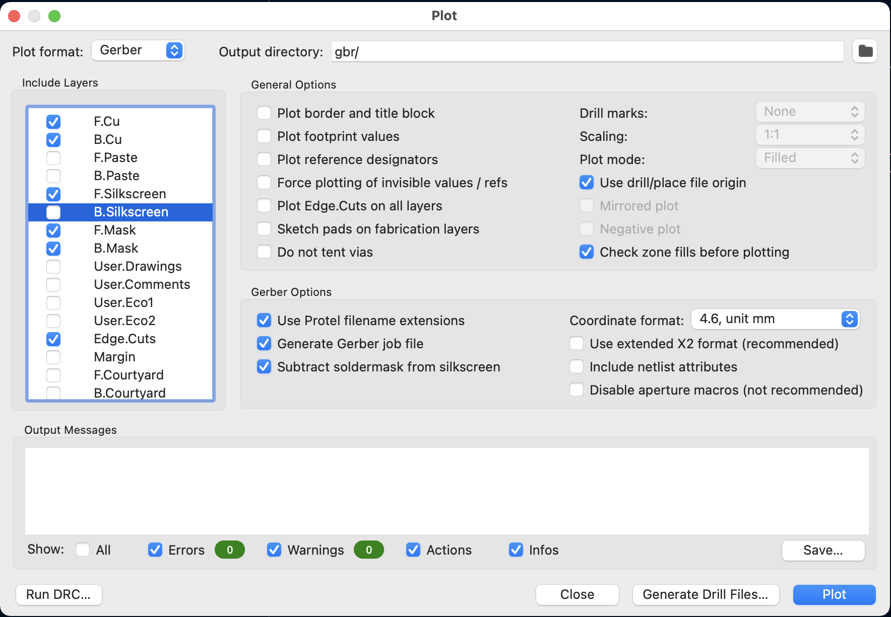
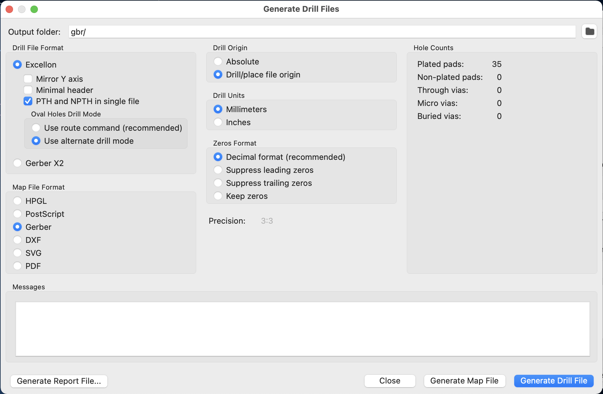

## HOW TO MAKE A FACEPLATE in KiCAD##
     
### Part 1: PCB Faceplate (holes and milling) ###

  
  1. Create a new folder called `MyProjectName-FACEPLATE` inside the kicad project directory. 

  2. Copy the pcb file (`MyProjectName.kicad_pcb`) and project file (`MyProjectMName.kicad_pro`) into the `MyProjectName-FACEPLATE` directory. Rename the file `MyProjectName-FACEPLATE.kicad_pcb`
 
  3. Open `MyProjectName-FACEPLATE.kicad_pcb` in Kicad PCB editor

  4. Delete all tracks, vias and extra text:
      - Check only `Tracks`, `Vias`, and `Text` in the Selection Filter (lower-right corner of the PCB window).
      - Make all layers visible (F.Cu, B.Cu, etc)
      - Drag to select everything on the board (only tracks and vias will be selected)
      - Press Delete
      
  5. Delete all footprints on the front side:
      - Check only `Footprints` in the Selection Filter
      - Make sure F.Cu layer is still visible
      - Drag to select everything on the board (only front footprints will be selected)
      - Press Delete

  6. Run the "Make faceplate Step 2 - Create outline" script.
      - It'll create a standard Eurorack module sized rectangle on the Edge.Cuts layer, and remove the previous board outline.
      - It'll also add Rail-Mounting slots.
      - If the board is 8HP or smaller, remove the top-right and bottom-right Rail-Mounting slots.
      
  7. Run the "Make faceplate Step 3 - Convert footprints" script.
      - All components should be converted to a large via that's reflected across the panel's center Y-axis. 
      - If any component remains, you need to:
          - 1) Manually convert it to a faceplate using the Change Footprint window.
          - 2) Reflect it across the center of the board by changing the X coordinate:
              - `FaceplateViaX = PanelLeftX + PanelRightX - OriginalComponentX`
  8. Run the "Make faceplate Step 4 - Ground plane" script.
      - All the faceplate vias will change to the "GND" net
      - A new GND zone will be added to the back layer. Press "B" to draw/update it (make sure zones are visible in the left toolbar or else you won't see it)
  9. Delete any extra graphics or text.
      - There should only be the GND zone; two or four rail-mounting slots in the corners; an Edge.Cuts rectangle that's 5.059" tall and the correct width (HP); and a bunch of faceplate vias or slots for the jacks, pots, LEDs, etc. 
      - The User.Comments layer might contain a rectangle of the original PCB dimensions. It's safe to ignore this (it might come in handy later if we have issues lining the artwork up). 
     

###Part 2: Artwork ###
  1. Open the Adobe Illustrator file of the artwork and hide all layers except the artwork (no holes, panel outline, milling, etc)
  2. Use Illustrator's Asset Export feature to export the artwork as a PNG at 2000ppi, with no Anti-aliasing. This gives us 0.5mil resolution. //Todo: create more detailed instructions for using Asset Export.// Note that if you use the Export for Screens... command in Illustrator then do not clip to the artboard (the file will be bigger than it needs to be and bitmap2component will choke).
  3. Create a new folder directly inside the project folder called `artwork sources` and put the Illustrator files and PNG exports in there.
  4. Create another new folder directly inside the project folder called `artwork.pretty` (we'll use it in the next step).
  5. Black & Gold, White & Silver faceplates (faceplates with copper, mask, and silk layers):
     * A black & gold faceplate is defined as having black mask and exposed copper (gold, silver, or tin plated), and white silk screen.
     * A white & silver faceplate is defined as having white mask and exposed copper (gold, silver, or tin plated), and a black silk screen.
     * Both of these require three artwork files: silk, copper, and mask
     * Black & Gold:
        * This is some advice based on our experience with the SWN: The silk layer should not overlap with the copper or mask layer. So wherever there is a pixel in the silk PNG, there should not be a pixel in the mask or copper PNG. Why? Because putting silk on top of a copper layer makes it look kind of runny. Putting silk on the mask layer means the silk is on top of a mask opening, so it's on bare FR4 and looks bad. Of course, you can break this rule but think carefully about it!
        * To make it look like silk is printed on top of copper, the copper should be cut out where the text appears. No silk should be where the copper is cut out. We want it to be black inside the copper, which means we want mask ink, not silk, inside the copper. Thus the
        * The copper and mask layers should be the same. This just means all copper will be exposed; and anywhere there's no copper there will be black mask (with or without silk on top of the mask). Why? If there is any difference between the copper and mask, it'll just look like a little raised bump where the mask opening is not present but the copper is; or conversely it'll be bare FR4 fiberglass where the mask opening is present and the copper is not.
        
     * White & Silver:
        * This advice is based on the SWN and the STS: the silk layer should not overlap with the copper or mask layers (same reasoning as for Black & Gold, see above). To make it look like words or art is printed on top of copper, the copper should be cut out where the words appears, and the silk layer should have the art.
        * The copper and mask layers should be different: The mask layer openings should appear wherever there is copper, plus there should be the mask openings where there's silk within a copper region. This makes the silk look like it's on top of the copper region.

  2. Bitmap2component (KiCAD program)
     * Click `Load Bitmap` and select the PNG file
     * Set Format to `Footprint (.kicad_mod file)`
     * Set Threshold to 50
     * Do not set check Negative
     * Set Board Layer for Outline to `Front silk screen`
     		* For black/gold or white/gold faceplates, select `Front solder mask` for the mask file, or select `Eco1.User` for the gold/copper layer (see below)
     * Set `Threshold Value` to 99
     * Click the `Black&White Picture` tab and verify the preview looks accurate.
     * Click `Export` and then  save the file in `artwork.pretty` folder. Call it `artwork-layername-revXXX.kicad_mod`, where layername is the layer (silk, copper, mask) and revXXX is the revision like "rev2c"
     * For black/gold or white/gold faceplates with the copper layer (Gold or Silver):
       * Unfortunately KiCAD does not support this directly. But it's easy to do manually:
     	  * You already should have exported the gold artwork to the `Eco1.User` layer
     	  * Open the .kicad_mod file in a text editor
     	  * Do a global search and replace for `Eco1.User`, replacing it with `F.Cu`
     	  * Save the file.
     
  9. Add the artwork as a footprint:
     * Open the pcb file in Kicad PCB Editor
     * Select Manager Footprint Libraries from the Preferences menu:
       *  Click the "Project Specific Libraries" tab
       *  Click the little folder icon
       *  Find the `artwork.pretty` folder and click on it, then click `Open`
       *  Confirm that it found the files (it should say "artwork" in the Library column). Click `OK`
 
     * Now add the artwork images:
       * Click the Add Footprint icon, click "List All", then type "artwork" in the field. It'll only show for footprints with the name artwork, which is what you should have named the .kicad_mod file.
       * Center it, position it carefully to it's lined up with the holes.
       * Bug Alert: Sometimes bitmap2component doesn't make it Negative, even if you select it. The imported image should have a transparent background and the silk screen should be a colored foreground. If the Negative setting is wrong, then the imported image will be mostly solid color with the text and artwork being transparent. Go back and try importing again, clicking Negative/Normal back and forth to clear and reset it.
       * Verify it looks good! Look over all the text carefully. If there's anything weird, make changes in illustrator, save as PNG, and convert with bitmap2component again.
     
  12. Create an origin, using the "drill/place origin" tool. Place it on the bottom left Edge of the board (zoom in to get it exact within +/-0.001"). It should display as a red cross-hair
  
### Part 3: Export and Verify ###
  
  13. Export the gerbers: 
    * Select "Gerber" for the Plot Format
    * Type `gbr/` for the `Output directory`.
    * Include layers: Check only `F.Cu`, `B.Cu`, `F.SilkS`, `F.Mask`, `B.Mask`, `Edge.Cuts`.   
    * General Options: de-select everything except:
      * Check `Use drill/place file origin`
      * Check `Check zone fills before plotting`
    * Gerber Options:
      * Check `Use Protel filename extensions` (only JLCPCB asks for this, not Posin or Imagineering)
      * Check `Generate gerber job file`
      * Check `Subtract soldermask from silkscreen`
      * Coorindate Format: select `4.6, unit mm`
    * Click `Plot` and it will export the gerbers.

    * Next click `Generate Drill File`
 		* Output directory: `gbr/`
   		* Drill File Format: Select `Excellon`, check `PTH and NPTH in single file`, uncheck `Mirror y axis` and uncheck `Minimal header`, and select `Use alternative drill mode`
    	* Map File Format is `Gerber`
    	* Drill origin is `Drill/place file origin`
    	* Drill Units: `Millimeters`
   		* Zeros Format: `Decimal format` 
    	* Click `Generate Drill File`
    	* Click `Generate Map File`
    	* Click close

  14. Open up Gerber Viewer from the Kicad project window.
  15. Select File > Open Gerb Job file... and open the .gbrjob file that's was just created in the gbr/ folder.
  16. BEFORE CLICKING ANYWHERE: Select File > Open Excellon Drill File and open the .drl file in the gbr/ folder.
      - If you did click somewhere, then before you open the .drl file, make sure that in the Layers Manager pane on the right, the first empty layer is selected (a little blue arrow shows which layer is selected, and empty layers are named "Graphic Layer ##")
  17. Verify the layers look good: zoom in and out, hide/show layers, select layers to bring them to the front, etc.
  		- TODO: list specific things to look for (problems, etc)
  
  18. Zip up the gerber files and drl files into a zip file named `MyProject-revision#.zip`. revision# should be either `p#` such as p1, p2, p3, etc for prototypes, or `v#.#` such as `v1.2` for production boards.
  19. Send the files to JLCPCB or Imagineering and you're done! 
 
 
 -------------------------------
 
### Making "clear" openings in a PCB ###
  * This is an experimental, advanced technique. The clear area must be blank in both copper and silk files, and must be present in both mask files. Getting this to happen is tricky...
    1. Front mask: put the clear section in the front mask PNG, so that it shows up in the front mask footprint (perhaps it would also work to have a secondary footprint that's just the clear section?)
    2. Front copper/silk: must be no copper or silk in the clear section. This is easy: just make sure the copper and silk PNGs are white in the area that needs to be clear.
    3. Back mask: The back mask file is not the same as the back copper anymore. I exported a back copper gerber before doing anything with the clear section. Then I renamed it as a back mask layer. This gave me a mask that covers the whole board, minus the milling (rail mount slots, slider slots). Another idea is to make a rectanglular mask that covers the whole board by manually typing in the coordinates into a text file to make a gerber file (as explained in the commented-out section above). However it's done, the back mask layer must cover the clear area so that the clear area is "masked", that is, no mask ink is applied to the area.
    4. Back copper: This was the hardest part to figure out. The back side should be a continguous zone except for the holes/milling and the clear area. I was able to do this by:
      5. bitmap2component: open the clear area PNG and export it as a copper layer
      6. add the component to the PCB, and flip it to the back side
      7. Position it where it needs to be
      8. Create a zone on the back side, connected to GND (should already have this)
      9. Press "B" to update the zone. It should automatically avoid touching the clear area copper footprint
      10. Select the clear area footprint and delete it. Immediately export the back copper layer gerber.
      11. Of course, if kicad ever changes whereby it automatically updates the zone when something is deleted, then this trick won't work. But perhaps we could still export a gerber before deleting the clear area footprint, and then manually delete these footprint's zones in the gerber file.
	