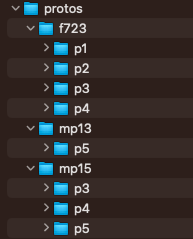
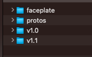
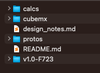
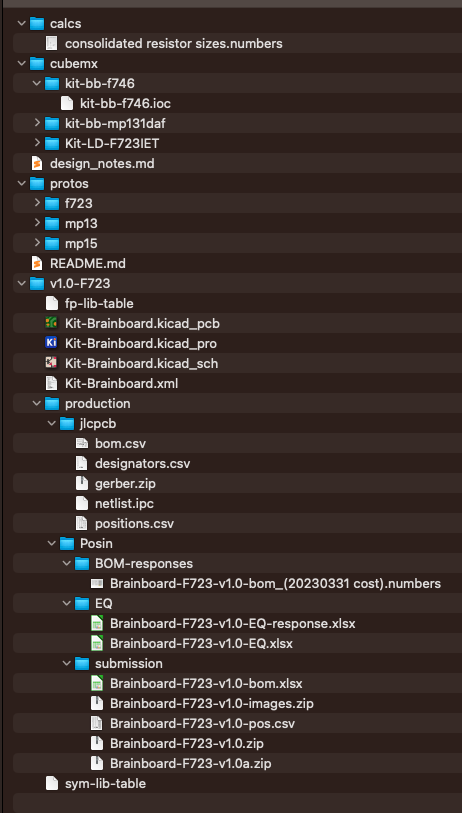
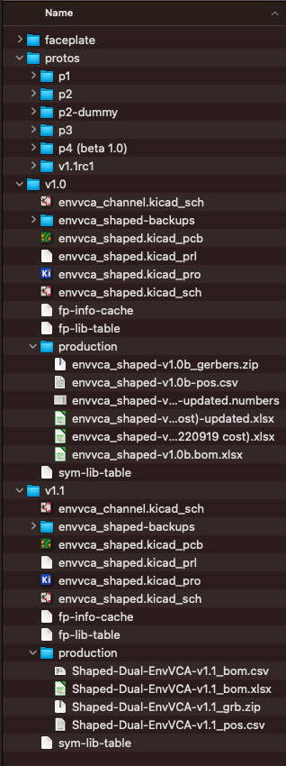

##Versions and Naming Conventions##

Proto names: **p1**, **p2**, **p3** ...

Production names: **v1.0**, **v1.1**, **v1.1a**, **v2.0**, **v1.1-f723**, **v1.1-m13** ...

In-progress revision names: **v1.1rc1**, **v1.1rc2**, **v1.2rc1** ...

##Overall concepts##
 - Only keep project folders for things we ordered, or are actively in development.

 - We often make corrections to production files from the time we start the ordering process until the time we receive the board. **Only keep the latest/corrected version of any production file.** Push each change to the git repo. In the unlikely event we need it, we can find the uncorrected version in the git history.
   - Example: just keep the latest version of the BOM for any particular order. That is, if Posin sends a BOM costs file and we find a mistake and send a corrected version, delete the old version.
   - Update the Kicad project immediately and push it. Overwrite the old version (we could find it in git if we had to). 
     - Exception: if it's just a replacement part for something temporarily out of stock, then don't update the Kicad project (but maybe add the alt part number to our library)

 - Don't change production files after the physical boards are received in-hand. Make a new project instead.

 - Don't keep **identical** copies of files. Just keep a file in one place. Having multiple copies wastes time trying to figure out which one to use, or updating both versions if there's a correction to be made.

 - Create subfolders when they're needed. Example: create the protos/ folder and put p1/, p2/, etc into it **after** we have a v1.0. Another example: the first time we order something, just put all the production files into production/. If we re-order that same version and some files changed, then use sub-folders inside of production/.

 - Every file we sent to the board house needs to be in the production/ folder for that PCB version. This makes it easy for anyone to know exactly what files we need to re-order something or check if Posin has the right version  (especially since we may not always order everything with Posin and JLCPCB).

 - Just keep the zipped copy of production files (gerbers, images...)

**DG: Check the above rules, do they match what we discussed? **

## Using Git ##
 - Create and push a git tag whenever you send files to be produced (any board house). Name the tag something like `JLCPCB-ordered` or `Posin-beta-units`
 - Use informative commit messages in git so that, in the unlikely event that we need to figure out some issue, we could look at the commit log and roll back. This means we don't need to keep all minor variations around, just the versions that were actually ordered with all corrections/fixes applied.

##Protos##
While a project is still being developed, all prototypes can exist in the root folder. But once there is a v1.0 created, and production has started, all **p#** folders must be moved into a folder called **protos**. The following is a guide for how a proto folder should look.

* ***p1/***
	* project.kicad_pcb
	* project.kicad_pro
	* project.kicad_sch
	* fp-lib-table
	* sym-lib-table
	* ***production/*** `Here we have only one production run, so we don't use sub-folders inside production/`
		* bom.csv
		* gerber.zip
		* positions.csv
		* parts-used.csv `< Download these files after ordering and save them here`
		* parts-unused.csv
* ***p2/***
	* project.kicad_pcb
	* project.kicad_pro
	* project.kicad_sch
	* fp-lib-table
	* sym-lib-table
	* ***production/*** `p2 was ordered from JLC and then later sent to Posin for beta units`
		* ***JLCPCB/*** 
			* bom.csv
			* gerber.zip
			* project-faceplate-rev1_gerber.zip `generated over from faceplate project`
			* positions.csv
		* ***Posin/***
			* ***bom-responses/***
             * project-p2-bom_(20230331 cost).xlsx `This is from Posin, plus our responses and corrections/fixes/adjustments. Notice we just keep the latest version, not every back-and-forth version`
			* ***EQ/***
				* project-p2-EQ-1.xlsx `An EQ from Posin, with our response`
				* project-p2-EQ-2.xlsx `A second EQ from Posin, with our response`
			* ***submission/*** `contains all the files that were sent to Posin`
				* project-p2-bom.xlsx
				* project-p2-pos.csv
				* project-p2-gerbers.zip `This was the original gerbers we sent to Posin. It's OK to delete this`
				* project-p2a-gerbers.zip `note: a letter is appended, if for example Posin notices an issue on the PCB and we make minor changes. The Kicad project should be saved so it matches p2a, not p2`
				* project-p2-images.zip

###Prototyping and Production version with different parts

In cases when multiple chips are being tested on different protos, the protos can be further grouped by the chip they are using. For example, in the image below there are three different chips being used: the f723, mp13 and mp15, each with their own folder. We can see mp15 branched at **p3** and mp13 branched at **p5**, while f723 started as **p1**

If a production unit is updated with a new part and nothing else about the circuit has been revised, **v1.0** can be renamed to include that part (ex. ***v1.0-f723***) and another **v1.0** will be created that includes the new part (ex. ***v1.0-mp13***)

	

##Released Versions, Root folder, and Revisions##

* ***faceplate/***
	* ***rev1/***
	* ***rev2/***
* ***protos/***
	* ***p1/***
	* ***p2/***
	* ***p3/***
	* ***v1.1rc1/***
	* ***v1.2rc1/*** `This is where we are putting fixes for the next revision`
* ***v1.0/***
	* project.kicad_pcb
	* project.kicad_pro
	* project.kicad_sch
	* fp-lib-table
	* sym-lib-table
	* ***production/***
		* ***bom-responses/***
			* project-v1.0-bom_(20230331 cost).xlsx
		* ***EQ/***
			* project-EQ.xlsx
			* project-EQ-response.xlsx
		* ***submission/*** `contains all the files that were sent to Posin`
			* project-v1.0-bom.xlsx
			* project-v1.0-pos.csv
			* project-v1.0-gerbers.zip
			* project-v1.0-images.zip
* ***v1.1/***
	* project.kicad_pcb
	* project.kicad_pro
	* project.kicad_sch
	* fp-lib-table
	* sym-lib-table
	* ***production/***
		* ***bom-responses/***
			* project-v1.1-bom_(20230331 cost).xlsx
		* ***EQ/***
			* project-EQ.xlsx
			* project-EQ-response.xlsx
		* ***submission/***
			* project-v1.1-bom.xlsx
			* project-v1.1-pos.csv
			* project-v1.1-gerbers.zip
			* project-v1.1a-gerbers.zip
			* project-v1.1b-gerbers.zip
			* `Notice there's no v1.1-images.zip, we don't need to put it here since we didn't change or resend it`

* Once a prototype has been beta tested/built from Posin, this is what happens:
  * The project (minus the production/ folder) is copied and renamed as **v1.0**
  * The silkscreen is be updated to say v1.0 and gerbers are re-exported
  * All production file names must also refer to v1.0. 
  * If the BOM is not re-exported, then it should be modified inside the file so it says v1.0 for the revision and anywhere else (e.g. the PCB BOM Item).
  * When submitted to Posin, inform them that the project name has changed
  * The images/build guides should remain in the folder when they were first submitted to Posin. For example if **p2** was when the first betas were ordered, the build guides can remain and that folder and do not need to be moved or copied to **v1.0**

* All protos are moved into a folder called **protos**
* Most projects have faceplates that are developed in the same way as PCBs and the faceplates folder should also be in the root folder.

Below is an example of what could would commonly be seen in the root folder.  Someone troubleshooting an RMA or failed unit should be able to open this folder and easily and quickly find v1.1 if they need it to make a repair.
 

Folders like `cubemx` and `calcs` contain project-wide files. They can live inside a version folder if they are specific to one version. The root folder can also include design notes or TODO lists that relate to the enitire project. The only versions we should see listed are versions that have gone into production (unless nothing has gone into production, in which case we can just see all the pX/ folders).

If **v1.0** comes back from Posin and needs rework/mods done, a **rework** folder is created within the **v1.0** folder that includes all nessesary mods to get the unit to be shipped out.

The submission folder for **v1.0** will more or less be a copy of the submission folder from from the protos submitted for betas, however the gerbers should be updated with the **v1.0** silk.

###Revisions

Revisions will be treated like protos and also live in the protos folder, however they will have a different naming convention. For example, if **v1.0** comes back from Posin and some revisions need to be made in order to make **v1.1**, the revision will be created in the protos folder and be called **v1.1rc1**.  The rc stands for "Release Candidate". This revision will go through the same process as a proto including production folders for JLCPCB. If a second revision is needed it will be named **v1.1rc2** and so on. Once **v1.1** is ready to be ordered from Posin, a **v1.1** folder will be created from the last revision and a new submission will be made to Posin with the updated project version being **v1.1**.

There is no need to resubmit or copy image/build guides. Posin will have them and, as long as nothing about the build changes, they will be used for all future versions. We should notify Posin if we change the name of a project, for example if we re-order p4 as v1.0 then we should Posin that from now on, we'll be calling it v1.0 (not p4).

###Faceplates

The final faceplate may reach v1.0 sooner than the PCBs and does not need to match the current PCB version. They don't typically get updated much past one or two prototypes. Oncer gerbers are generated and the panel is confirmed, a **v1.0** folder can be made and its production folder could contain only the zipped gerbers. Those gerbers should be copied to the first Posin submission folder. **DG: Let's discuss faceplate naming conventions**

##BOMs vs Gerbers##

In the situation when gerbers v1.0 are submitted to posin, and an error is found *before the boards are made*, the correction should be made in Kicad, and new gerbers should be generated and given the name v1.0a. A letter is added anytime the version has been generated but then changed **before the boards are made**. If there are changes after the boards are made, it gets a new project folder.

For BOM, in the past adding a letter has been used, however, using a datecode is likely what we will do moving forward, since it is typically already provided and there is a lot more back and forther when figuring out the BOM. **DG: This is ambigious whether it means adding a datecode when we make a new order (like, 6 months later) vs. if we make a change two days after ordering but before the boards are made. I'm proposing we don't keep any old version, only the latest (for any particular order)**

###When version don't match
It's common to have one submission include a faceplate that is v1.0, PCB gerbers that are v1.1, and a BOM that is v1.0. In this example, the faceplate was made at v1.0 and hasn't needed to be changed. The PCB was revised and updated to v1.1 but still matched the same v1.0 faceplate. And if the circuit was updated but no parts were added or changed, the last BOM can still be used even though it doesn't match the most recent version. Any submissions to posin should be in the submission folder for that PCB version. **DG: But, Posin always sends a BOM-cost file, so wouldn't that get the v1.1? I think we can simplify this paragraph to just mention faceplate versions vs. PCB versions.**

##Examples

 

**DG: These need to be updated to reflect the above rules:**

  - Remove .xml files
  - Remove EQ files (just keep the response)
  - possibly remove the original Brainboard-F723-v1.0.zip file (keep v1.0a.zip)
  - not sure what p2-dummy is, is that discussed in this doc?
  - is p4 (beta 1.0) mentioned in this doc?
  - Shaped/v1.0/production has multiple versions of the BOM. We should just keep the latest (if you accept my proposal to do so), and/or at least put the bom-responses in a separate folder from the submission files.
  - Shaped/v1.1/production has the .csv and .xlsx BOM files, we should delete the .csv
  - Probably should show the faceplate/ folder contents
