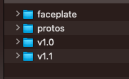
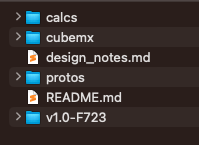
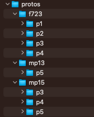
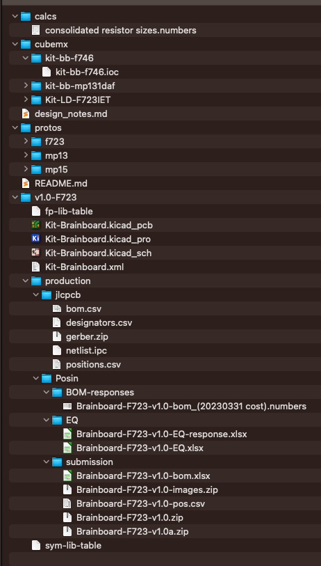
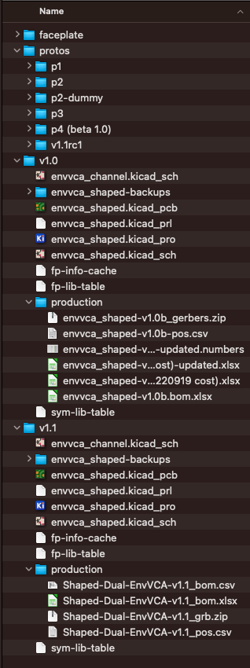

## Versions and Naming Conventions ##

Proto names: **p1**, **p2**, **p3** ...

Production names: **v1.0**, **v1.1**, **v1.1a**, **v2.0**, **v1.1-f723**, **v1.1-m13** ...

In-progress production revision names: **v1.1rc1**, **v1.1rc2**, **v1.2rc1** ...

## Overall concepts ##
 - **Only keep versions that were actually made into a physical PCB, or are actively in development.**

	- Stated another way: If we order a board, then we make corrections to the gerbers or BOM and re-send the corrected files, then just keep the corrected version that was actually produced.

	- Stated another way: Do not keep old PCB, schematic, gerbers, or BOMs that have errors unless we physically built a board with those errors on it.

   - Example: We need to order a PCB+Assembly. Send the files to Posin. Then commit them, tag the commit "Ordered with Posin", and push to the git repo. Then Posin sends a BOM costs file and there is a mistake. Make the corrections in the BOM and/or schematic and send it back to Posin. Then make a commit, tag it and push it to the git repo. The old uncorrected files only exist in the git history at this point.

 - Don't change production files after the physical boards are received in-hand. Make a new project with a new version instead. Stated another way: every version folder represents a physical board we received.

 - Don't keep **identical** copies of files. Just keep a file in one place. Having multiple copies wastes time trying to figure out which one to use, or updating both versions if there's a correction to be made.

 - Create subfolders when they're needed. Example: create the protos/ folder and put p1/, p2/, etc into it **after** we have a v1.0. Another example: the first time we order something, just put all the production files into production/. If we re-order that same version and some files changed, then use sub-folders inside of production/.

 - Every file we sent to the board house needs to be in the production/ folder for that PCB version. This makes it easy for anyone to know exactly what files we need to re-order something or check if Posin has the right version  (especially since we may not always order everything with Posin and JLCPCB).

 - Just keep the zipped copy of production files (gerbers, images...)

## Using Git ##

 - Create and push a git tag whenever you send files to be produced (any board house). Name the tag something like `JLCPCB-ordered` or `Posin-beta-units`
 - Use informative commit messages in git so that, in the unlikely event that we need to figure out some issue, we could look at the commit log and roll back. This means we don't need to keep all minor variations around, just the versions that were actually ordered with all corrections/fixes applied.

## Project example (Proto stage) ##

While a project is still being developed, all prototypes can exist in the root folder. Faceplates get their own folder on the root level

* ***faceplate/***
	* ***rev1/***
		* project-faceplate.kicad_pcb
		* project-faceplate.kicad_pro
		* artwork.pretty/
		* artwork sources/
		* fp-lib-table
		* lineup/ `any files needed for lining up the faceplate with PCB and/or artwork files`
		* *Notice there are no gerber files here, they are in the production folder of the main PCB folder. Only put gerbers here if we ordered the faceplates independently from a project (e.g. black faceplates that we stock separately)*

* ***p1/***
	* project.kicad_pcb
	* project.kicad_pro
	* project.kicad_sch
	* fp-lib-table
	* sym-lib-table
	* ***production/*** *Here we have only one production run, so we don't use sub-folders inside production/*
		* bom.csv
		* gerber.zip
		* positions.csv
		* parts-used.csv *< Download these files from JLCPCB after ordering and save them here*
		* parts-unused.csv
* ***p2/***
	* project.kicad_pcb
	* project.kicad_pro
	* project.kicad_sch
	* fp-lib-table
	* sym-lib-table
	* ***production/*** *p2 was ordered from JLC and then later sent to Posin for beta units*
		* ***JLCPCB/*** 
			* bom.csv
			* gerber.zip
			* project-faceplate-rev1_gerber.zip *generated over from faceplate project*
			* positions.csv
		* ***Posin/***
			* ***bom-responses/***
             * project-p2-bom_(20230331 cost).xlsx *This is from Posin, plus our responses and corrections/fixes/adjustments. Notice we just keep the latest version, not every back-and-forth version*
			* ***EQ/***
				* project-p2-EQ-1.xlsx *An EQ from Posin, with our response*
				* project-p2-EQ-2.xlsx *A second EQ from Posin, with our response*
			* ***submission/*** *contains all the files that were sent to Posin*
				* project-p2-bom.xlsx
				* project-p2-pos.csv
				* *The original gerbers we sent to Posin were project-p2-gerbers.zip. This file is deleted*
				* project-p2a-gerbers.zip *This is the corrected gerbers we sent to Posin (notice the letter 'a' is appended). For example Posin noticed an issue on the PCB and we made minor changes. Notice we do not have a p2a/ folder or project. We just updated the p2 Kicad project with the fixes and didn't rename it or make a new project since the original p2 was never physically built*
				* project-p2-images.zip

## Released Versions, Root folder, and Revisions ##

Once there is a v1.0 created, and production has started, all **p#** folders must be moved into a folder called **protos**. 

* ***faceplate/***
	* ***rev1/***
	* ***rev2/***
		* project-faceplate-rev2.kicad_pcb
		* project-faceplate-rev2.kicad_pro
		* artwork.pretty/
		* artwork sources/
		* fp-lib-table
		* `Notice no gerbers here`
	* ***rev2-black/***
		* project-faceplate-rev2.kicad_pcb
		* project-faceplate-rev2.kicad_pro
		* artwork.pretty/
		* artwork sources/
		* fp-lib-table
		* production/
			* project-faceplate-rev2-black-gerbers.zip `We order this separately, it's not part of the normal production`
* ***protos/***
	* ***p1/***
	* ***p2/***
	* ***p3/***
	* ***v1.1rc1/***
	* ***v1.2rc1/*** `This is where we are putting fixes for the next revision`
* ***v1.0/***
	* project.kicad_pcb
	* project.kicad_pro
	* project.kicad_sch
	* fp-lib-table
	* sym-lib-table
	* ***production/***
		* ***bom-responses/***
			* project-v1.0-bom_(20230331 cost).xlsx
		* ***EQ/***
			* project-EQ.xlsx
			* project-EQ-response.xlsx
		* ***submission/*** `contains all the files that were sent to Posin`
			* project-v1.0-bom.xlsx
			* project-v1.0-pos.csv
			* project-v1.0-gerbers.zip
			* project-v1.0-images.zip
* ***v1.1/***
	* project.kicad_pcb
	* project.kicad_pro
	* project.kicad_sch
	* fp-lib-table
	* sym-lib-table
	* ***production/***
		* ***bom-responses/***
			* project-v1.1-bom_(20230331 cost).xlsx
		* ***EQ/***
			* project-EQ.xlsx
			* project-EQ-response.xlsx
		* ***submission/***
			* project-v1.1-bom.xlsx
			* project-v1.1-pos.csv
			* project-v1.1-gerbers.zip
			* project-v1.1a-gerbers.zip
			* project-v1.1b-gerbers.zip
			* `Notice there's no v1.1-images.zip, we don't need to put it here since we didn't change or resend it`

* Once a prototype has been beta tested/built from Posin, this is what happens:
  * The project (minus the production/ folder) is copied and renamed as **v1.0**
  * The silkscreen is be updated to say v1.0 and gerbers are re-exported
  * All production file names must also refer to v1.0. 
  * If the BOM is not re-exported, then it should be modified inside the file so it says v1.0 for the revision and anywhere else (e.g. the PCB BOM Item).
  * When submitted to Posin, inform them that the project name has changed
  * The images/build guides should remain in the folder when they were first submitted to Posin. For example if **p2** was when the first betas were ordered, the build guides can remain and that folder and do not need to be moved or copied to **v1.0**

* All protos are moved into a folder called **protos**
* Most projects have faceplates that are developed in the same way as PCBs and the faceplates folder should also be in the root folder.

Below is an example of what could would commonly be seen in the root folder.  Someone troubleshooting an RMA or failed unit should be able to open this folder and easily and quickly find v1.1 if they need it to make a repair.
 

Folders like `cubemx` and `calcs` contain project-wide files. They can live inside a version folder if they are specific to one version. The root folder can also include design notes or TODO lists that relate to the enitire project. The only versions we should see listed are versions that have gone into production (unless nothing has gone into production, in which case we can just see all the pX/ folders).

If **v1.0** comes back from Posin and needs rework/mods done, a **rework** folder is created within the **v1.0** folder that includes all nessesary mods to get the unit to be shipped out.

The submission folder for **v1.0** will more or less be a copy of the submission folder from from the protos submitted for betas, however the gerbers should be updated with the **v1.0** silk.

### Projects variations for different chips

#### Prototypes

In cases when multiple chips are being tested on different protos, then the projects can be further grouped by the chip they are using. For example, in the image below there are three different chips being used: the f723, mp13x and mp15x, each with their own folder. We can see mp15x branched at **p3** and mp13x branched at **p5**, while f723 started as **p1**. (Do not do this for production versions, this is only a convenience for prototyping when we want to explore multiple branches at the same time).

#### Production

If we have several variations of a product that ANY of them can be ordered and none of them are the "latest" version (that is, they are all the "latest" version), then add a suffix to the version like `v1.0-f723` and `v1.0-f746`. This is a rare edge case, but it happened during the chip shortages, when we would have more than one v1.0 versions ready to order if any of the chips became available.
	
### Revisions

Revisions will be treated like protos and also live in the protos folder, however they will have a different naming convention. For example, if **v1.0** comes back from Posin and some revisions need to be made in order to make **v1.1**, the revision will be created in the protos folder and be called **v1.1rc1**.  The rc stands for "Release Candidate". This revision will go through the same process as a proto including production folders for JLCPCB. If a second revision is needed it will be named **v1.1rc2** and so on. Once **v1.1** is ready to be ordered from Posin, a **v1.1** folder will be created from the last revision and a new submission will be made to Posin with the updated project version being **v1.1**.

There is no need to resubmit or copy image/build guides. Posin will have them and, as long as nothing about the build changes, they will be used for all future versions. We should notify Posin if we change the name of a project, for example if we re-order p4 as v1.0 then we should Posin that from now on, we'll be calling it v1.0 (not p4).

### Faceplates

Faceplates should be named with `rev1`, `rev2`, etc. This avoids confusion with things like having a v1.0.1 faceplate and a v1.2 PCB.
Many projects use v1.0 for the final production faceplate, which is OK, but it's also OK to keep the faceplate version as `rev4` for the production version.
The important thing to remember to do manually is that for normal faceplates that go onto modules *put the faceplate gerbers in the PCB production folder*. On the other hand, for faceplates that are ordered alone (not as part of a PCBA module assembly), these gerbers can live in the `faceplate/revX/production/` folder.

## BOMs vs Gerbers ##

In the situation when gerbers v1.0 are submitted to posin, and an error is found *before the boards are made*, the correction should be made in Kicad, and new gerbers should be generated and given the name v1.0a. A letter is added anytime the version has been generated but then changed **before the boards are made**. If there are changes after the boards are made, it gets a new project folder.

### When version don't match
It's common to have one submission include a faceplate that is rev2, PCB gerbers that are v1.1, and a BOM that is v1.0. That's OK and there is no need to update versions if no changes were made. 

## Examples ##

 

**These need to be updated to reflect the above rules:**

  - Remove .xml files
  - Remove EQ files (just keep the response)
  - possibly remove the original Brainboard-F723-v1.0.zip file (keep v1.0a.zip)
  - not sure what p2-dummy is, is that discussed in this doc?
  - is p4 (beta 1.0) mentioned in this doc?
  - Shaped/v1.0/production has multiple versions of the BOM. We should just keep the latest (if you accept my proposal to do so), and/or at least put the bom-responses in a separate folder from the submission files.
  - Shaped/v1.1/production has the .csv and .xlsx BOM files, we should delete the .csv
  - Probably should show the faceplate/ folder contents
