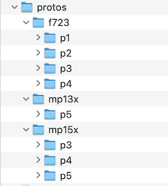

##Versions and Naming Conventions##

Proto names: **p1**, **p2**, **p3** ...

Production names: **v1.0**, **v1.1**, **v1.1a**, **v2.0**, **v1.1-f723**, **v1.1-m13** ...

In-progress revision names: **v1.1rc1**, **v1.1rc2**, **v1.2rc1** ...

##Overall concepts##

 - No extra subfolders until they're needed. Example: we only create the protos/ folder and put p1/, p2/, etc into it after we've gone into production.
 - Don't copy production files from project to project.
 - Use git tags whenever you send files to be produced (any board house)
 - Use informative commit messages in git so that, if we need to figure out some issue, we could pin point what happened at a point in the past. This also means we don't need to keep all minor variations around, just the versions that were actually ordered and are currently in development.
 - Every file we sent to any board house needs to be in the prodution/ folder for that PCB version. This makes it easy for anyone (not just PCB/hardware team) to know exactly what files we need to re-order something (especially since we may not order everything with Posin). This includes questions and responses from Posin.
 

##Protos##
While a project is still being developed, all prototypes can exist in the root folder. But once there is a v1.0 created, and production has started, all **p#** folders must be moved into a folder called **protos**. The following is a guide for how a proto folder should look.

* ***p1/***
	* project.kicad_pcb
	* project.kicad_pro
	* project.kicad_sch
	* fp-lib-table
	* sym-lib-table
	* ***production/*** `If there's just one production run, there's no need for sub-folders.`
		* bom.csv
		* gerber.zip
		* positions.csv
		* parts-used.csv `< Download these files after ordering and save them here`
		* parts-unused.csv `<`
* ***p2/***
	* project.kicad_pcb
	* project.kicad_pro
	* project.kicad_sch
	* fp-lib-table
	* sym-lib-table
	* ***production/*** `p2 was ordered from JLC and then later sent to Posin for beta units`
		* ***JLCPCB*** 
			* project_bom.csv
			* project_gerber.zip
			* project-faceplate_gerber.zip `copied over from faceplate project`
			* project_positions.csv
		* ***Posin***
			* ***bom-responses***
				* project-bom_(20230331 cost).xlsx
			* ***EQ***
				* project-EQ.xlsx
				* project-EQ-response.xlsx
			* ***submission*** `contains all the files that were sent to Posin`
				* project-p2-bom.xlsx
				* project-p2-pos.csv
				* project-p2-gerbers.zip
				* project-p2a-gerbers.zip `note: a letter is added after, if for example posin notices an issue on the PCB and we make minor changes. Do not save a copy of the v1.0 Kicad project, make sure it's updated to match v1.0a`
				* project-p2-images.zip `If there are no changes, then images/build guides should be moved (not copied) and renamed to v1.0 once betas are confirmed`

###Prototyping and Production version with different parts

In cases when multiple chips are being tested on different protos, the protos can be further grouped by the chip they are using. For example, in the image below there are three different chips being used: the f723, mp13 and mp15, each with their own folder. We can see mp15 branched at **p3** and mp13 branched at **p5**, while f723 started as **p1**

If a production unit is updated with a new part and nothing else about the circuit has been revised, **v1.0** can be renamed to include that part (ex. ***v1.0-f723***) and another **v1.0** will be created that includes the new part (ex. ***v1.0-mp13***)

	

##Released Versions, Root folder, and Revisions##

* ***faceplate***
	* ***p1***
	* ***v1.0***
* ***protos***
	* ***p1***
	* ***p2***
	* ***v1.1rc1***
* ***v1.0***
* ***v1.1***

* Once a prototype has been beta tested/built from Posin, the project is copied and renamed as **v1.0**. The silkscreen must be updated to say v1.0 and all production files must also refer to v1.0. When submitted to posin, they need to know the new/correct project name and version.  The images/build guides should remain in the folder when they were first submitted to Posin. For example if **p2** was when the first betas were ordered, the build guides can remain and that folder and do not need to be moved or copied to **v1.0**. 
* All protos, are moved into a folder called **protos** so all that can be seen from the root folder is the following. Most projects have faceplates that are developed in the same way as PCBs and the faceplates folder should also be in the root folder.

Below is an example of what could would commonly be seen in the root folder.  Someone troubleshooting an RMA or failed unit should be able to open this folder and easily and quikcly find the v1.1 if the need it to make a repair.
 

Folders like 'cubemx' contains any files relating the CubeMX. The root folder can include design notes or TODO lists that relate to the enitire project. The only versions we should see listed are versions that have gone into production.

If **v1.0** comes back from Posin and needs rework/mods done, a **rework** folder is created within the **v1.0** folder that includes all nessesary mods to get the unit to be shipped out.

The submission folder for **v1.0** will more or less be a copy of the submission folder from from the protos submitted for betas, however the gerbers should be updated with the **v1.0** silk.

###Revisions

Revisions will be treated like protos and also live in the protos folder, however they will have a different naming convention. For example, if **v1.0** comes back from Posin and some revisions need to be made in order to make **v1.1**, the revision will be created in the protos folder and be called **v1.1rc1**. This revision will go through the same process as a proto including production folders for JLCPCB. If a second revision is needed it will be named **v1.1rc2** and so on. Once **v1.1** is ready to be ordered from Posin, a **v1.1** folder will be created from the last revision and a new submission will be made to Posin with the updated project version being **v1.1**.

There is no need to resubmit or copy image/build guides. Posin will have them and, as long as nothing about the build changes, they will be used for all future versions.

###Faceplates

The final faceplate may reach v1.0 sooner than the PCBs and does not need to match the current PCB version. They don't typically get updated much past one or two prototypes. Oncer gerbers are generated and the panel is confirmed, a **v1.0** folder can be made and its production folder could contain only the zipped gerbers. Those gerbers should be copied to the first Posin submission folder.

##BOMs vs Gerbers##

in the situation when gerbers v1.0 are submitted to posin, and an error is found, those gerbers need to be update to be v1.0a. A letter is added anytime the version has been generated but then changed after posin provides feedback.

For BOM, in the past adding a letter has been used, however, using a datecode is likely what we will do moving forward, since it is typically already provided and there is a lot more back and forther when figuring out the BOM.

###When version don't match
It's common to have one submission include a faceplate that is v1.0, PCB gerbers that are v1.1, and a BOM that is v1.0. In this example, the faceplate was made at v1.0 and hasn't needed to be changed. The PCB was revised and updated to v1.1 but still matched the same v1.0 faceplate. And if the circuit was updated but no parts were added or changed, the last BOM can still be used even though it doesn't match the most recent version. Any submissions to posin should be in the submission folder for that PCB version.

##Examples

 

