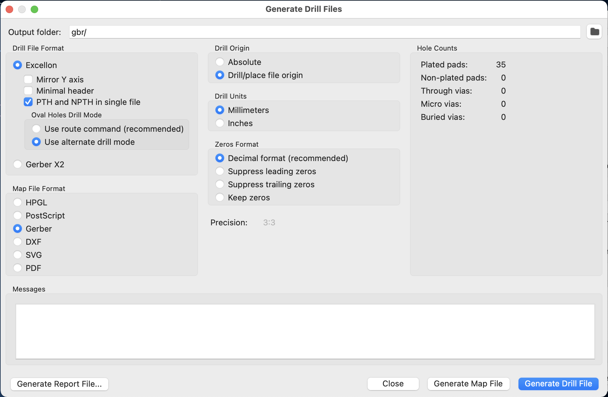

## How to Export a PCB for Assembly at JLCPCB ##


### Prepare ###

First, create a JLCPCB folder inside the project folder.

### Position File ###
2. Export the position file from Kicad:
	* Open the PCB.
	* File menu > fabrication output > component placement
	* Type "JLCPCB" in the output directory (same folder you just created)
	* Check the following:
		- Format: CSV
		- Use drill/place file origin 
		- Units: Millimeters 
		- Files: Separate files for front, back 

	* Click  generate position file 

3. Convert the kicad-format pos file to a JLCPCB-format pos file: 
	* Run the `pos_file_convert` python script on the top **or** bottom csv position file. (JLCPCB will only do assembly on one side, so you have to know at this point if you want the top or bottom side assembled).
		* You need to have already cloned the 4ms-kicad-script repo somewhere on your computer.
	* Open the terminal and type the command like this:
		
		```
		python3 [path to 4ms-kicad-script]/XY-pos-file-convert/pos_file_convert.py [path to pos csv file]
		```
	* The script will create a new file with `-jlcpcb.csv` at the end. You will need this file along with the gerber .zip file and the BOM csv file to order from JLCPCB.

	* Example: Let's say the 4ms-kicad-script repo is in ~/Desktop/kicad, and project you're doing is in ~/Desktop/kicad/pcb-envvca-mini/p2/. So, then the command would be:

       ```
       python3 ~/Desktop/kicad/4ms-kicad-script/XY-pos-file-convert/pos_file_convert.py /Users/noaver/Desktop/kicad/pcb-envvca_mini/p2/JLCPCB/envvca-mini-top-pos.csv
		```

   * See Terminal Tips at the bottom of this file for tips using the terminal
   
   
### Exporting the Gerbers and Drill Files ###

1. From Kicad PCB, Go File > Plot


	Plot format: Gerber 
	Output directory: ‘gbr/‘
	
	Included layers, check only the following:
	  - F.Cu
	  - B.Cu
	  - F.Paste
	  - B.Paste (only if there are SMT parts on the back)
	  - F.SilkS
	  - B.SilkS
	  - F.Mask
	  - B.Mask
	  - Edge.Cuts
	
	General Options, check only the following:
	  - Plot reference designators 
	  - Use drill/place file origin 
	  - Check zone fills before plotting 
	
	You *may* check "Plot footprint values" if you are sure you've already hidden all component values. 
	To be safe, leave it unchecked unless you've previewed the board with values shown.
	
	Gerber Options, check only the following:
	  - Use Protel filename extensions (checked for JLCPCB but NOT for Posin)
	  - Generate Gerber job file (optional, saves a few clicks)
	  - Subtract soldermask from silkscreen 
	  - Select Coordinate format: 4.6, unit mm


2. Click Plot to export Gerbers 

3. Click Generate Drill Files... to open the drill dialog up:



	Drill file Format:
	  - Excellon 
	  - PTH and NPTH in single file 
	  - Use alternate drill mode 
	
	Map File Format: Gerber 
	Drill Origin: Drill/place file origin 
	Drill Units: Millimeters 
	Zeros Format: Decimal Format (recommended)

4. Click Generate Drill File

5. Click Generate Map File 

6. Go into project folder, make sure all the Gerber files are present

7. Zip them up (except the .gbrjob file), rename the zip file 

## Check the Gerber files (optional for simple boards) ##


## BOM Generation ##

1. Open the schematic in KiCad.

2. From the menu bar selection Tools > Generate BOM... or click the “generate a bill of materials from the current schematic” button on the tool bar.

3. Select from the Bom generator Scripts: `pcba_bom_4ms_JLCPCB`
	- If it's not present, then click the + icon and find your installation of 4ms-kicad-script. Then open the file named `pcba_bom_4ms_JLCPCB.py` in the BOM-scripts folder.

4. Click Generate
5. Look for errors in the large text box on the right. Ignore "missing libpart for ref:" errors
6. You should see an .xml and a .csv file in the project folder. Delete the .xml file and move the .csv file into the JLCPCB folder (it's nice to rename it as PROJECTNAME-jlcpcb-bom.csv)


## Ordering ##
You should now have:
  - a zip file of the gerbers and drill files
  - a BOM csv file in JLCPCB format
  - a XY pos csv file in JLCPCB format

Go to JLCPCB.com and place your order using the gerbers.

Enable SMT Assembly and select the top or bottom side, depending on which one we want assembled for this project.

Upload the BOM and pos files when requested.

Do your best to find substitute parts for anything that's either out of stock or that we didn't supply a JLCPCB number. Ask for help if you're not sure of a substitution.

When it shows the preview of the assembled board with the parts placed, check for errors. If you see something rotated by 90, 180, or 270 degrees, then you need to go back in the web browser and re-upload a corrected pos file. To correct the pos file:

  - 1) Edit the pos csv file by changing the value in the rotation column. It's easiest to edit it as a text file, not as a spreadsheet.
  - 2) Keep track of what you had to rotate and report that back to someone who can update the Pos file script.
  
  OR --
  
  - 1) Edit the `cpl_rotations_db.csv` file in the XY-pos-file-convert folder, either editting the rotation amount for a footprint (if it already is in the file) or adding a new line like this:
  - 
	```
	^TSOP-5,180
	```
	
	This will rotate any footprint that starts with TSOP-5, by 180 degrees
  - 2) Then re-run the python script command to generate a new -jlcpcb.csv pos file

------------------------------


*Tips for using the terminal:*

* Type the first few letters of a file or dir name, then hit tab to autofill:
	- Example:

    ```
    python3 ~/Desk<tab>/kicad/4ms-kicad-s<tab>/XY<tab>/p<tab> ~/Desk<tab>/kicad/pcb-envv<tab>/p2/J<tab>/en<tab>top<tab>
    ```
	
* Up arrow shows you the prev command you entered. Keep hitting up arrow to scroll backwards through your command history. Down arrow moves you forward in time.
