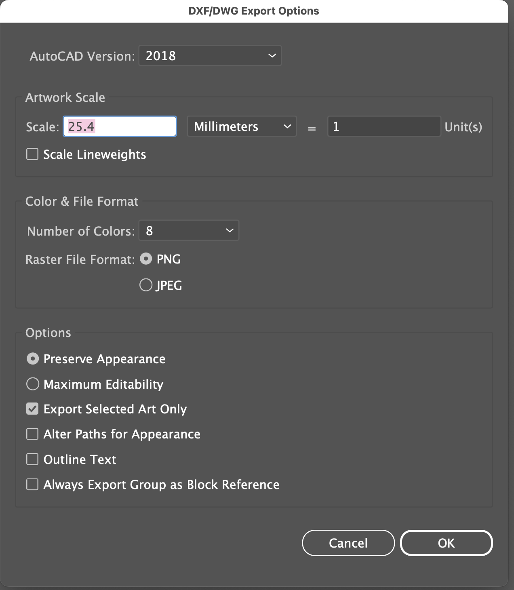
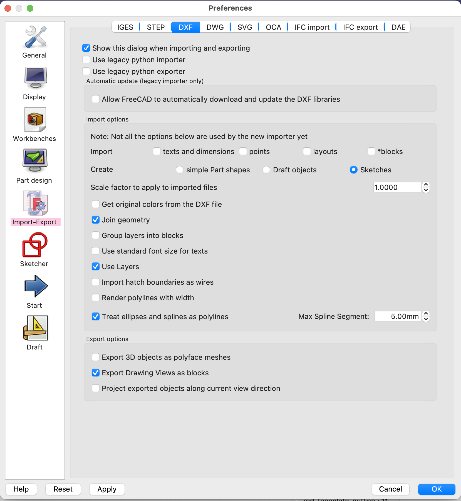

In short:

  * From a PCB faceplate, export the FMask layer as a PDF, including Edge.Cuts on the layer
  * Use AI to create circles with the exact diameter of the hole, and place them exactly where the holes need to go. Do the same for cutouts/slots
  * In AI, delete everything but the circles/slots and edge. Make sure everything is a closed shape, not a collection of separate lines/curves.
  * In AI, make all objects have no fill and thin black line width
  * Set the artboard to match the dimensions of the faceplate (not sure if this is necessary)
  * Not sure if this matters, but File > Document Setup has units set to mm.
  * Select all, then do File > Export As. Select DXF and click Save. 
  * In the options that pop up, type 25.4mm = 1 units, and uncheck "Alter Paths for Appearance". See image 
	
  * Open FreeCAD (tested with 0.19), create a new document
  * File > Import, select the DXF file. Here are the settings that work: 
  * Check the dimensions are right
  * Go to Draft workbench. Select the Shapes that were created and select from the menu Modification > Draft to Sketch. (or click the button for "Convert bidirectionally between Drafts and Sketches")
  * Delete the Part objects
  * Go to Part Design workbench. 
  * Create a new body
  * Drag the sketch into the body on the Model tree view pane
  * Click the sketch in the Model tree view pane to select it. Then click Pad, or select Part Design > Create an additive feature > Pad.
  * Set the length to 1.6mm (typically)
  * If it works, then click the Pad in the Model tree view, then select File > Export. Export it as a .stp file
